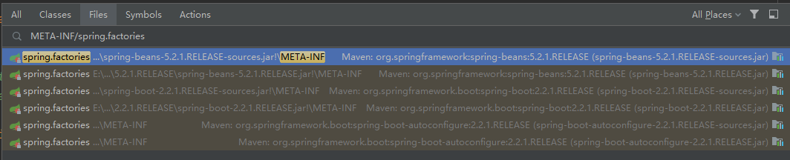
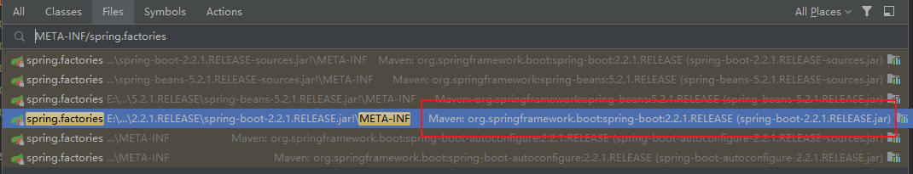

这是一个 Spring Boot 的启动类

```java
import org.springframework.boot.SpringApplication;
import org.springframework.boot.autoconfigure.SpringBootApplication;

@SpringBootApplication
public class FullstackApplication {

    public static void main(String[] args) {
        SpringApplication.run(FullstackApplication.class, args);
    }
}
```

启动类会调用 `SpringApplication` 类的`run` 方法，`run` 方法的方法体如下

```java
public static ConfigurableApplicationContext run(Class<?> primarySource, String... args) {
   return run(new Class<?>[] { primarySource }, args);
}
```

它调用了另外一个 `run` 方法

```java
public static ConfigurableApplicationContext run(Class<?>[] primarySources, String[] args) {
   return new SpringApplication(primarySources).run(args);
}
```

这个 `run` 方法会创建一个 `SpringApplication` 类的实例，然后调用实例的 `run` 方法。来看一下构造方法的源码

```java
public SpringApplication(Class<?>... primarySources) {
    this(null, primarySources);
}

@SuppressWarnings({ "unchecked", "rawtypes" })
public SpringApplication(ResourceLoader resourceLoader, Class<?>... primarySources) {
   this.resourceLoader = resourceLoader;
   Assert.notNull(primarySources, "PrimarySources must not be null");
   this.primarySources = new LinkedHashSet<>(Arrays.asList(primarySources));
   this.webApplicationType = WebApplicationType.deduceFromClasspath();
   setInitializers((Collection) getSpringFactoriesInstances(ApplicationContextInitializer.class));
   setListeners((Collection) getSpringFactoriesInstances(ApplicationListener.class));
   this.mainApplicationClass = deduceMainApplicationClass();
}
```

这个构造方法做了以下几件事

## 1. 赋值成员变量 resourceLoader

```java
this.resourceLoader = resourceLoader;
```

传进来的 `resourceLoader` 是 `null`

## 2. 赋值成员变量 primarySources

```java
Assert.notNull(primarySources, "PrimarySources must not be null");
this.primarySources = new LinkedHashSet<>(Arrays.asList(primarySources));
```

首先校验传进来的 `primarySources` 是否为 `null`，如果是 `null` 就抛出 `IllegalArgumentException` 异常。校验通过就存放到 `primarySources` 容器中

## 3. 推断应用类型

```java
this.webApplicationType = WebApplicationType.deduceFromClasspath();
```

`WebApplicationType.deduceFromClasspath()` 方法内部会再调用 `ClassUtils.isPresent`  判断某些类是否可以在 classpath 中找到并实例化成功，以此来推断应用类型

```
static WebApplicationType deduceFromClasspath() {
   if (ClassUtils.isPresent(WEBFLUX_INDICATOR_CLASS, null) && !ClassUtils.isPresent(WEBMVC_INDICATOR_CLASS, null)
         && !ClassUtils.isPresent(JERSEY_INDICATOR_CLASS, null)) {
      return WebApplicationType.REACTIVE;
   }
   for (String className : SERVLET_INDICATOR_CLASSES) {
      if (!ClassUtils.isPresent(className, null)) {
         return WebApplicationType.NONE;
      }
   }
   return WebApplicationType.SERVLET;
}
```

应用环境有 3 种：

- `WebApplicationType.REACTIVE` 运行在内置响应式网页服务器的响应式的网页应用
- `WebApplicationType.NONE` 非 Web 应用
- `WebApplicationType.SERVLET` 运行在内置servlet服务器的 servlet 网页应用

## 4. 加载并实例化 ApplicationContextInitializer

```java
setInitializers((Collection) getSpringFactoriesInstances(ApplicationContextInitializer.class));
```

## 5. 加载并实例化 ApplicationListener

```java
setListeners((Collection) getSpringFactoriesInstances(ApplicationListener.class));
```

## 6. 推断 main 方法所在的类

```java
this.mainApplicationClass = deduceMainApplicationClass();
```

它是通过新建一个 `RuntimeException` 对象获取调用栈，然后查找方法名是 `main` 的方法，这样就找到 `main` 方法所在的类了

```java
private Class<?> deduceMainApplicationClass() {
   try {
      StackTraceElement[] stackTrace = new RuntimeException().getStackTrace();
      for (StackTraceElement stackTraceElement : stackTrace) {
         if ("main".equals(stackTraceElement.getMethodName())) {
            return Class.forName(stackTraceElement.getClassName());
         }
      }
   }
   catch (ClassNotFoundException ex) {
      // Swallow and continue
   }
   return null;
}
```

## 核心方法 getSpringFactoriesInstances

在 “4. 设置系统初始化器” 和 “5. 设置监听器” 中，都调用了 `getSpringFactoriesInstances` 方法。这是一个很重要的方法

```java
private <T> Collection<T> getSpringFactoriesInstances(Class<T> type, Class<?>[] parameterTypes, Object... args) {
   ClassLoader classLoader = getClassLoader();
   // Use names and ensure unique to protect against duplicates
   Set<String> names = new LinkedHashSet<>(SpringFactoriesLoader.loadFactoryNames(type, classLoader));
   List<T> instances = createSpringFactoriesInstances(type, parameterTypes, classLoader, args, names);
   AnnotationAwareOrderComparator.sort(instances);
   return instances;
}
```

这个方法内部分为几个步骤

### 1. 获取 ClassLoader

```java
ClassLoader classLoader = getClassLoader();
```

### 2. 获取实现类的完整类名列表

```java
Set<String> names = new LinkedHashSet<>(SpringFactoriesLoader.loadFactoryNames(type, classLoader));
```

`SpringFactoriesLoader.loadFactoryNames` 方法的实现是

```java
public static List<String> loadFactoryNames(Class<?> factoryType, @Nullable ClassLoader classLoader) {
   String factoryTypeName = factoryType.getName();
   return loadSpringFactories(classLoader).getOrDefault(factoryTypeName, Collections.emptyList());
}
```

首先获取工厂类的名称。`ApplicationContextInitializer.class` 的名称是 `org.springframework.context.ApplicationContextInitializer`，`ApplicationListener` 的名称是 `org.springframework.context.ApplicationListener`

然后调用 `loadSpringFactories` 方法，**这个方法很重要**

```java
private static Map<String, List<String>> loadSpringFactories(@Nullable ClassLoader classLoader) {
   MultiValueMap<String, String> result = cache.get(classLoader);
   if (result != null) {
      return result;
   }

   try {
      Enumeration<URL> urls = (classLoader != null ?
            classLoader.getResources(FACTORIES_RESOURCE_LOCATION) :
            ClassLoader.getSystemResources(FACTORIES_RESOURCE_LOCATION));
      result = new LinkedMultiValueMap<>();
      while (urls.hasMoreElements()) {
         URL url = urls.nextElement();
         UrlResource resource = new UrlResource(url);
         Properties properties = PropertiesLoaderUtils.loadProperties(resource);
         for (Map.Entry<?, ?> entry : properties.entrySet()) {
            String factoryTypeName = ((String) entry.getKey()).trim();
            for (String factoryImplementationName : StringUtils.commaDelimitedListToStringArray((String) entry.getValue())) {
               result.add(factoryTypeName, factoryImplementationName.trim());
            }
         }
      }
      cache.put(classLoader, result);
      return result;
   }
   catch (IOException ex) {
      throw new IllegalArgumentException("Unable to load factories from location [" +
            FACTORIES_RESOURCE_LOCATION + "]", ex);
   }
}
```

这个方法做了 3 件事：

1. 缓存是否有需要的内容
2. 寻找需要的内容
3. 将寻找到的内容加入缓存中

```java
MultiValueMap<String, String> result = cache.get(classLoader);
if (result != null) {
    return result;
}
```

`MultiValueMap<String, String>` 是 Spring 框架自己封装的集合类，它其实就是 `Map<String, List<String>>`。key 是我们传入的工厂类的名称，比如 `org.springframework.context.ApplicationContextInitializer` 和 `org.springframework.context.ApplicationListener`，value 是实现类的名称集合

缓存如果命中就返回，没有就去寻找需要的内容

```java
public static final String FACTORIES_RESOURCE_LOCATION = "META-INF/spring.factories";

Enumeration<URL> urls = (classLoader != null ?
      classLoader.getResources(FACTORIES_RESOURCE_LOCATION) :
      ClassLoader.getSystemResources(FACTORIES_RESOURCE_LOCATION));
result = new LinkedMultiValueMap<>();
while (urls.hasMoreElements()) {
   URL url = urls.nextElement();
   UrlResource resource = new UrlResource(url);
   Properties properties = PropertiesLoaderUtils.loadProperties(resource);
   for (Map.Entry<?, ?> entry : properties.entrySet()) {
      String factoryTypeName = ((String) entry.getKey()).trim();
      for (String factoryImplementationName : StringUtils.commaDelimitedListToStringArray((String) entry.getValue())) {
         result.add(factoryTypeName, factoryImplementationName.trim());
      }
   }
}
```

首先使用调用 `ClassLoader` 的 `getResource` 方法去寻找 `META-INF/spring.factories` 文件，这个文件有很多份



它的内容就是按照 `properties` 文件的格式来整理，有 key 也有对应的 value。key 是工厂类的名称，values 是用逗号隔开的实现类名称列表。比如 `spring-boot-2.2.1.RELEASE.jar` 里的  `META-INF/spring.factories` 文件



它的内容如下

```properties
# Application Context Initializers
org.springframework.context.ApplicationContextInitializer=\
org.springframework.boot.context.ConfigurationWarningsApplicationContextInitializer,\
org.springframework.boot.context.ContextIdApplicationContextInitializer,\
org.springframework.boot.context.config.DelegatingApplicationContextInitializer,\
org.springframework.boot.rsocket.context.RSocketPortInfoApplicationContextInitializer,\
org.springframework.boot.web.context.ServerPortInfoApplicationContextInitializer

# Application Listeners
org.springframework.context.ApplicationListener=\
org.springframework.boot.ClearCachesApplicationListener,\
org.springframework.boot.builder.ParentContextCloserApplicationListener,\
org.springframework.boot.context.FileEncodingApplicationListener,\
org.springframework.boot.context.config.AnsiOutputApplicationListener,\
org.springframework.boot.context.config.ConfigFileApplicationListener,\
org.springframework.boot.context.config.DelegatingApplicationListener,\
org.springframework.boot.context.logging.ClasspathLoggingApplicationListener,\
org.springframework.boot.context.logging.LoggingApplicationListener,\
org.springframework.boot.liquibase.LiquibaseServiceLocatorApplicationListener
```

然后解析这些  `META-INF/spring.factories` 文件，找到 `org.springframework.context.ApplicationContextInitializer` 和 `org.springframework.context.ApplicationListener` 对应的值。最后加入缓存中并返回

```java
cache.put(classLoader, result);
return result;
```

### 3. 实例化实现类

```java
List<T> instances = createSpringFactoriesInstances(type, parameterTypes, classLoader, args, names);
```

### 4. 给实例化后的对象列表进行排序

```java
AnnotationAwareOrderComparator.sort(instances);
```

