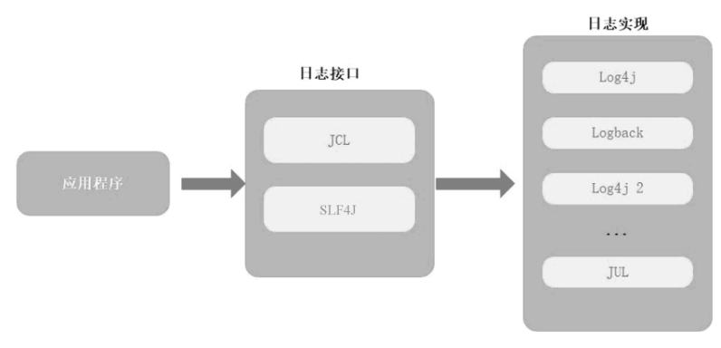
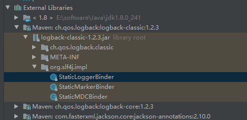
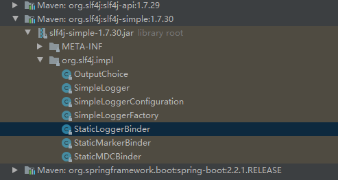
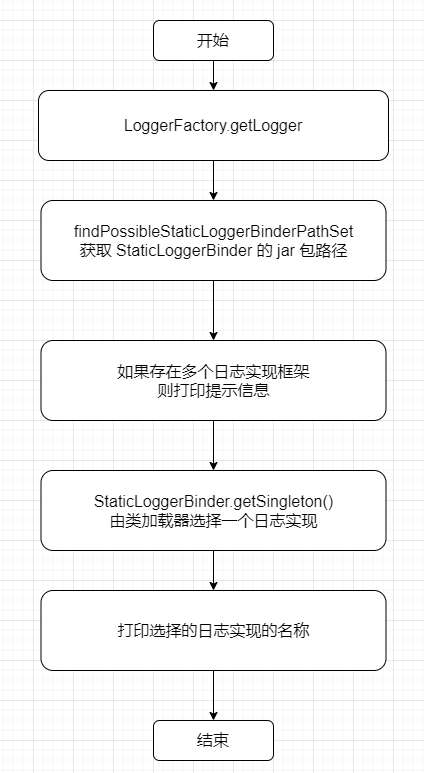

## 日志的发展历程

JDK 1.3 及以前，是通过 `System.(out|err).pringln` 打印日志，这种方式存在很大的缺陷

于是，Log4j 出现了，它很受欢迎，成为了 Apache 基金会的一员。Apache 基金会建议 Sun 引入 Log4j 到 Java 的标准库中，但被Sun拒绝了

受到 Log4j 的影响，SUN 公司推出了 Java Util Logging，也就是 JUL。它基本模仿了 Log4j 的实现

接着，Apache推出了 Jakarta Commons Logging，即 JCL。它定义了一套日志接口（其内部也提供一个 Simple Log 的简单实现），支持运行时动态加载日志组件的实现。也就是说，在应用程序代码中，只需调用 Commons Logging 的接口，底层实现可以是 Log4j，也可以是 JUL

后来 Log4j 的作者不适应 Apache 的工作方式，离开了 Apache。先后创建了 SLF4J 和 Logback 两个项目。SLF4J 类似于 Commons Logging，属于日志门面，而Logback 是对 SLF4J 日志门面的实现

因此，Java 日志领域被划分为两大阵营：Commons Logging 阵营和 SLF4J 阵营。最受欢迎的是 SLF4J 阵营。Apache 眼看有被 Logback 反超的势头，重写了Log4j，成立了新的项目 Log4j 2


日志框架之间的关系如下图所示。JCL 和 SLF4J 属于日志接口，提供统一的日志操作规范，日志功能由具体的日志实现框架（例如 Log4j、Logback等）完成



## 推荐的日志框架

推荐以下两种组合：

- slf4j + Logback
- slf4j + Log4j2

## 日志的用法

SpringBoot 的日志默认使用 slf4j + Logback 组合。在使用日志框架的时候，都是这么使用的。首先定义一个 `log` 变量，然后获取 `Logger`

```java
import org.slf4j.Logger;
import org.slf4j.LoggerFactory;

public class FullstackApplication {

    private Logger log = LoggerFactory.getLogger(FullstackApplication.class);

}
```

然后就可以打印日志了

```java
log.info('日志内容...')
```

那么 `LoggerFactory.getLogger` 它做了什么工作？是怎么寻找到 slf4j 的实现的？

## slf4j 是如何与实现进行绑定的？

`LoggerFactory.getLogger()` 的方法体如下

```java
public static Logger getLogger(Class<?> clazz) {
    Logger logger = getLogger(clazz.getName());
    if (DETECT_LOGGER_NAME_MISMATCH) {
        Class<?> autoComputedCallingClass = Util.getCallingClass();
        if (autoComputedCallingClass != null && nonMatchingClasses(clazz, autoComputedCallingClass)) {
            Util.report(String.format("Detected logger name mismatch. Given name: \"%s\"; computed name: \"%s\".", logger.getName(),
                            autoComputedCallingClass.getName()));
            Util.report("See " + LOGGER_NAME_MISMATCH_URL + " for an explanation");
        }
    }
    return logger;
}
```

中间的 `if` 语句不重要，重点是开头的 `getLogger(clazz.getName())`

```java
public static Logger getLogger(String name) {
    ILoggerFactory iLoggerFactory = getILoggerFactory();
    return iLoggerFactory.getLogger(name);
}
```

方法体内调用 `getILoggerFactory()` 获取 `ILoggerFactory` 实例。`ILoggerFactory` 是一个 slf4j 的接口，由 Logback 去实现的

```java
public static ILoggerFactory getILoggerFactory() {
    if (INITIALIZATION_STATE == UNINITIALIZED) {
        synchronized (LoggerFactory.class) {
            if (INITIALIZATION_STATE == UNINITIALIZED) {
                INITIALIZATION_STATE = ONGOING_INITIALIZATION;
                performInitialization();
            }
        }
    }
    switch (INITIALIZATION_STATE) {
    case SUCCESSFUL_INITIALIZATION:
        return StaticLoggerBinder.getSingleton().getLoggerFactory();
    case NOP_FALLBACK_INITIALIZATION:
        return NOP_FALLBACK_FACTORY;
    case FAILED_INITIALIZATION:
        throw new IllegalStateException(UNSUCCESSFUL_INIT_MSG);
    case ONGOING_INITIALIZATION:
        // support re-entrant behavior.
        // See also http://jira.qos.ch/browse/SLF4J-97
        return SUBST_FACTORY;
    }
    throw new IllegalStateException("Unreachable code");
}
```

因为是第一次获取 Logger，状态是 `UNINITIALIZED` 所以只需要看第一段代码即可

```java
if (INITIALIZATION_STATE == UNINITIALIZED) {
    synchronized (LoggerFactory.class) {
        if (INITIALIZATION_STATE == UNINITIALIZED) {
            INITIALIZATION_STATE = ONGOING_INITIALIZATION;
            performInitialization();
        }
    }
}
```

这是一个双重校验，目的是执行 `performInitialization()` 进行初始化

```java
private final static void performInitialization() {
    bind();
    if (INITIALIZATION_STATE == SUCCESSFUL_INITIALIZATION) {
        versionSanityCheck();
    }
}
```

这段代码只需要看 `bind()` 方法的实现即可，后面的不重要

```java
private final static void bind() {
    try {
        Set<URL> staticLoggerBinderPathSet = null;
        // skip check under android, see also
        // http://jira.qos.ch/browse/SLF4J-328
        if (!isAndroid()) {
            staticLoggerBinderPathSet = findPossibleStaticLoggerBinderPathSet();
            reportMultipleBindingAmbiguity(staticLoggerBinderPathSet);
        }
        // the next line does the binding
        StaticLoggerBinder.getSingleton();
        INITIALIZATION_STATE = SUCCESSFUL_INITIALIZATION;
        reportActualBinding(staticLoggerBinderPathSet);
        fixSubstituteLoggers();
        replayEvents();
        // release all resources in SUBST_FACTORY
        SUBST_FACTORY.clear();
    } catch (NoClassDefFoundError ncde) {
        String msg = ncde.getMessage();
        if (messageContainsOrgSlf4jImplStaticLoggerBinder(msg)) {
            INITIALIZATION_STATE = NOP_FALLBACK_INITIALIZATION;
            Util.report("Failed to load class \"org.slf4j.impl.StaticLoggerBinder\".");
            Util.report("Defaulting to no-operation (NOP) logger implementation");
            Util.report("See " + NO_STATICLOGGERBINDER_URL + " for further details.");
        } else {
            failedBinding(ncde);
            throw ncde;
        }
    } catch (java.lang.NoSuchMethodError nsme) {
        String msg = nsme.getMessage();
        if (msg != null && msg.contains("org.slf4j.impl.StaticLoggerBinder.getSingleton()")) {
            INITIALIZATION_STATE = FAILED_INITIALIZATION;
            Util.report("slf4j-api 1.6.x (or later) is incompatible with this binding.");
            Util.report("Your binding is version 1.5.5 or earlier.");
            Util.report("Upgrade your binding to version 1.6.x.");
        }
        throw nsme;
    } catch (Exception e) {
        failedBinding(e);
        throw new IllegalStateException("Unexpected initialization failure", e);
    }
}
```

这一段就是核心代码了

```java
Set<URL> staticLoggerBinderPathSet = null;
// skip check under android, see also
// http://jira.qos.ch/browse/SLF4J-328
if (!isAndroid()) {
    staticLoggerBinderPathSet = findPossibleStaticLoggerBinderPathSet();
    reportMultipleBindingAmbiguity(staticLoggerBinderPathSet);
}
// the next line does the binding
StaticLoggerBinder.getSingleton();
INITIALIZATION_STATE = SUCCESSFUL_INITIALIZATION;
reportActualBinding(staticLoggerBinderPathSet);
```
首先定义一个 `Set<URL>` 集合，后面要用到。然后获取所有的 `StaticLoggerBinder`  path

```java
// We need to use the name of the StaticLoggerBinder class, but we can't
// reference
// the class itself.
private static String STATIC_LOGGER_BINDER_PATH = "org/slf4j/impl/StaticLoggerBinder.class";

static Set<URL> findPossibleStaticLoggerBinderPathSet() {
    // use Set instead of list in order to deal with bug #138
    // LinkedHashSet appropriate here because it preserves insertion order
    // during iteration
    Set<URL> staticLoggerBinderPathSet = new LinkedHashSet<URL>();
    try {
        ClassLoader loggerFactoryClassLoader = LoggerFactory.class.getClassLoader();
        Enumeration<URL> paths;
        if (loggerFactoryClassLoader == null) {
            paths = ClassLoader.getSystemResources(STATIC_LOGGER_BINDER_PATH);
        } else {
            paths = loggerFactoryClassLoader.getResources(STATIC_LOGGER_BINDER_PATH);
        }
        while (paths.hasMoreElements()) {
            URL path = paths.nextElement();
            staticLoggerBinderPathSet.add(path);
        }
    } catch (IOException ioe) {
        Util.report("Error getting resources from path", ioe);
    }
    return staticLoggerBinderPathSet;
}
```

每个 slf4j 的实现，都要创建一个 `org.slf4j.impl.StaticLoggerBinder` 类，让 slf4j 框架去加载。一个项目里可能会有多个 slf4j 的实现，比如既有 Logback，又有 Log4j2，那么就会有多个 `org.slf4j.impl.StaticLoggerBinder` 

比如 Logback 的情况



slf4j-simple 中的情况



把这些 `StaticLoggerBinder` 都加入 `Set<URL>` 集合中，然后返回。执行下一个方法

```java
/**
 * Prints a warning message on the console if multiple bindings were found
 * on the class path. No reporting is done otherwise.
 * 
 */
private static void reportMultipleBindingAmbiguity(Set<URL> binderPathSet) {
    if (isAmbiguousStaticLoggerBinderPathSet(binderPathSet)) {
        Util.report("Class path contains multiple SLF4J bindings.");
        for (URL path : binderPathSet) {
            Util.report("Found binding in [" + path + "]");
        }
        Util.report("See " + MULTIPLE_BINDINGS_URL + " for an explanation.");
    }
}

private static boolean isAmbiguousStaticLoggerBinderPathSet(Set<URL> binderPathSet) {
    return binderPathSet.size() > 1;
}
```

如果有多个 `StaticLoggerBinder`，就打印提示信息

```
SLF4J: Class path contains multiple SLF4J bindings.
SLF4J: Found binding in [jar:file:/E:/software/apache-maven-repo/ch/qos/logback/logback-classic/1.2.3/logback-classic-1.2.3.jar!/org/slf4j/impl/StaticLoggerBinder.class]
SLF4J: Found binding in [jar:file:/E:/software/apache-maven-repo/org/slf4j/slf4j-simple/1.7.30/slf4j-simple-1.7.30.jar!/org/slf4j/impl/StaticLoggerBinder.class]
SLF4J: See http://www.slf4j.org/codes.html#multiple_bindings for an explanation.
```

有这么多个 `StaticLoggerBinder`，由 Java 的类加载器自己选择一个。然后执行以下方法，完成 slf4j 与实现类的绑定。并将当前的状态设置为初始化成功

```java
StaticLoggerBinder.getSingleton();
INITIALIZATION_STATE = SUCCESSFUL_INITIALIZATION;
```

slf4j 还会告知绑定的是哪一个框架的 `StaticLoggerBinder`

```java
private static void reportActualBinding(Set<URL> binderPathSet) {
    // binderPathSet can be null under Android
    if (binderPathSet != null && isAmbiguousStaticLoggerBinderPathSet(binderPathSet)) {
        Util.report("Actual binding is of type [" + StaticLoggerBinder.getSingleton().getLoggerFactoryClassStr() + "]");
    }
}
```

比如输出

```
SLF4J: Actual binding is of type [ch.qos.logback.classic.util.ContextSelectorStaticBinder]
```

以上的过程就是 slf4j 与实现绑定的过程。流程图如下




