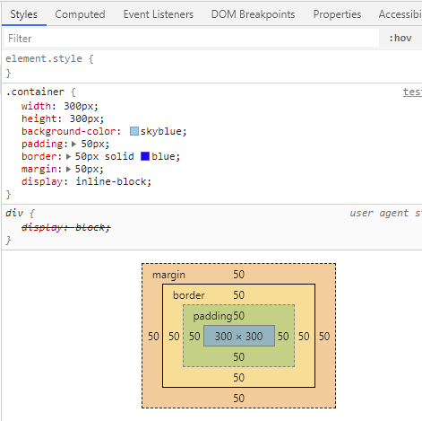
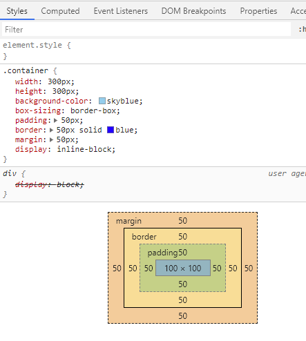

## content-box

默认情况下，`box-sizing` 是 `content-box`

比如有一个 300x300 的正方形

```html
<!DOCTYPE html>
<html lang="en">

<head>
  <meta charset="UTF-8">
  <meta name="viewport" content="width=device-width, initial-scale=1.0">
  <title>练习</title>
</head>

<body>
  <div class="container">
  </div>
  <style>
    .container {
      width: 300px;
      height: 300px;
      background-color: skyblue;
      padding: 50px;
      border: 50px solid blue;
      margin: 50px;
      display: inline-block;
    }
  </style>
</body>

</html>
```

打开 Chrome 的开发者工具，可以看到，内容的宽高是 300x300，`padding`、`border` 和 `margin` 都是包围在内容外部的



### 结论

`box-sizing` 为 `content-box` 时，占据的空间大小由 `width`、`border`、`padding` 和 `margin` 一起决定，此时的 `width` 和 `height` 指定的是内容的大小

## border-box

```html
<!DOCTYPE html>
<html lang="en">

<head>
  <meta charset="UTF-8">
  <meta name="viewport" content="width=device-width, initial-scale=1.0">
  <title>练习</title>
</head>

<body>
  <div class="container">
  </div>
  <style>
    .container {
      width: 300px;
      height: 300px;
      background-color: skyblue;
      box-sizing: border-box;
      padding: 50px;
      border: 50px solid blue;
      margin: 50px;
      display: inline-block;
    }
  </style>
</body>

</html>
```

打开 Chrome 的开发者工具，可以看到，内容的大小等于 `width` 和 `height` 减去 `padding`。占据的大小等于 `width` 加上 `border` 加上 `margin`



