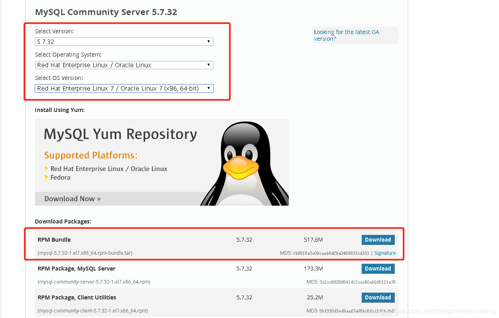

# 下载 MySQL

到这个地址下载 https://dev.mysql.com/downloads/mysql/



# 卸载系统中默认的数据库 MariaDB

```sh
[root@bigdata1 ~]# rpm -qa | grep mariadb
mariadb-libs-5.5.65-1.el7.x86_64
[root@bigdata1 ~]# yum remove -y mariadb-libs-5.5.65-1.el7.x86_64
```

# 解压安装包

```sh
[root@bigdata1 software]# tar -xvf mysql-5.7.32-1.el7.x86_64.rpm-bundle.tar
mysql-community-client-5.7.32-1.el7.x86_64.rpm
mysql-community-common-5.7.32-1.el7.x86_64.rpm
mysql-community-devel-5.7.32-1.el7.x86_64.rpm
mysql-community-embedded-5.7.32-1.el7.x86_64.rpm
mysql-community-embedded-compat-5.7.32-1.el7.x86_64.rpm
mysql-community-embedded-devel-5.7.32-1.el7.x86_64.rpm
mysql-community-libs-5.7.32-1.el7.x86_64.rpm
mysql-community-libs-compat-5.7.32-1.el7.x86_64.rpm
mysql-community-server-5.7.32-1.el7.x86_64.rpm
mysql-community-test-5.7.32-1.el7.x86_64.rpm
```


# 安装 MySQL

## 1）安装 common

```sh
[root@bigdata1 software]# rpm -ivh mysql-community-common-5.7.32-1.el7.x86_64.rpm
```

## 2）安装 libs

```#sh
[root@bigdata1 software]# rpm -ivh mysql-community-libs-5.7.32-1.el7.x86_64.rpm
```

## 3） 安装 client

```sh
[root@bigdata1 mysql5.7]# rpm -ivh mysql-community-client-5.7.32-1.el7.x86_64.rpm
```

## 4）安装 server

```sh
[root@bigdata1 mysql5.7]# rpm -ivh mysql-community-server-5.7.32-1.el7.x86_64.rpm
```

## 5）查看安装结果

```sh
[root@bigdata1 mysql5.7]# rpm -qa | grep mysql
mysql-community-libs-5.7.32-1.el7.x86_64
mysql-community-client-5.7.32-1.el7.x86_64
mysql-community-server-5.7.32-1.el7.x86_64
mysql-community-common-5.7.32-1.el7.x86_64
```

# 修改目录的访问权限

```sh
[root@bigdata1 mysql5.7]# chmod -R 777 /var/lib/mysql/
```

# 初始化 MySQL

```sh
[root@bigdata1 mysql5.7]# mysqld --initialize
[root@bigdata1 mysql5.7]# chmod -R 777 /var/lib/mysql/*
```

# 启动 MySQL

```sh
[root@bigdata1 mysql5.7]# service mysqld start
```

# 查看 root 用户的初始密码

```sh
[root@bigdata1 mysql5.7]# grep 'temporary password' /var/log/mysqld.log
2020-11-24T07:21:10.569320Z 1 [Note] A temporary password is generated for root@localhost: Z.wuYQ9h1:))
```

# 连接 MySQL

然后输入初始密码

```sh
mysql -u root -p
Enter password:
Welcome to the MySQL monitor.  Commands end with ; or \g.
Your MySQL connection id is 2
Server version: 5.7.32

Copyright (c) 2000, 2020, Oracle and/or its affiliates. All rights reserved.

Oracle is a registered trademark of Oracle Corporation and/or its
affiliates. Other names may be trademarks of their respective
owners.

Type 'help;' or '\h' for help. Type '\c' to clear the current input statement.

mysql>
```

# 修改 root 用户的初始密码

```mysql
mysql> alter user user() identified by '123';
Query OK, 0 rows affected (0.00 sec)
```

# 允许 root 用户远程登陆

## 修改 root 用户的 host

```mysql
mysql> use mysql;
mysql> UPDATE user SET host = '%' WHERE user = 'root';
mysql> FLUSH PRIVILEGES;
```

## 修改配置文件

打开 `my.cnf`

```
vi /etc/my.cnf
```

在 `[mysqld]` 下增加两个配置

```ini
[mysqld]
# 端口修改为 33006
port=33006
# 设置服务器编码
character_set_server = utf8
# 允许任何IP连接
bind-address=0.0.0.0
```

配置改完需要重启 Mysql

```sh
[root@bigdata1 mysql5.7]# service mysqld restart
```

## 系统防火墙开放 33006 端口

```sh
[root@bigdata1 mysql5.7]# firewall-cmd --zone=public --add-port=33006/tcp --permanent
[root@bigdata1 mysql5.7]# firewall-cmd --reload
```