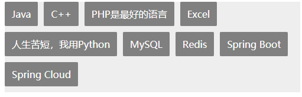
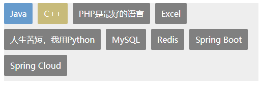

有这样一个界面

```html
<!DOCTYPE html>
<html lang="en">

<head>
  <meta charset="UTF-8">
  <meta name="viewport" content="width=device-width, initial-scale=1.0">
  <title>练习</title>
  <script src="https://cdn.jsdelivr.net/npm/vue/dist/vue.js"></script>
</head>

<body>
  <div id="app">
    <div class="container">
      <div class="item" v-for="(item, index) in tagList" :key="index">{{ item }}</div>
    </div>
  </div>
  <script>
    new Vue({
      el: '#app',
      data: {
        tagList: [
          'Java', 'C++', 'PHP是最好的语言', 'Excel', '人生苦短，我用Python', 'MySQL', 'Redis', 'Spring Boot', 'Spring Cloud'
        ]
      }
    })
  </script>
  <style>
    .container {
      width: 500px;
      display: flex;
      flex-wrap: wrap;
      background-color: #EEEEEE;
    }

    .item {
      padding: 10px 12px;
      border-radius: 2px;
      background-color: gray;
      color: white;
      margin-bottom: 10px;
      margin-right: 10px;
    }
  </style>
</body>

</html>
```

页面效果如下



如果想对实现第一个和第二个子元素的颜色进行改变，分别添加上 `#569ccc` 和 `#cbba7d` 两个颜色。效果图如下



## 在 index 上做文章

对 index 进行判断

```css
.bg_blue {
    background-color: #569ccc;
}

.bg_yellow {
    background-color: #cbba7d;
}
```

```html
<div class="container">
    <div class="item" 
         :class="index === 0 ? 'bg_blue' : '' || index === 1 ? 'bg_yellow' : ''"
         v-for="(item, index) in tagList" 
         :key="index"
	>{{ item }}</div>
</div>
```

只加了这一句代码

```html
:class="index === 0 ? 'bg_blue' : '' || index === 1 ? 'bg_yellow' : ''"
```

## 在 CSS 上做文章

利用 `nth-child` 选择器来实现

```css
.container > .item:nth-child(1) {
    background-color: #569ccc;
}

.container > .item:nth-child(2) {
    background-color: #cbba7d;
}
```

